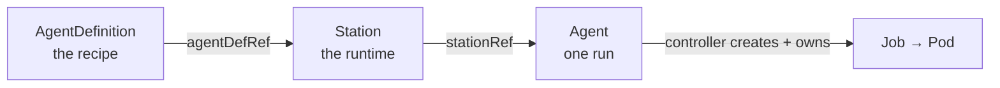
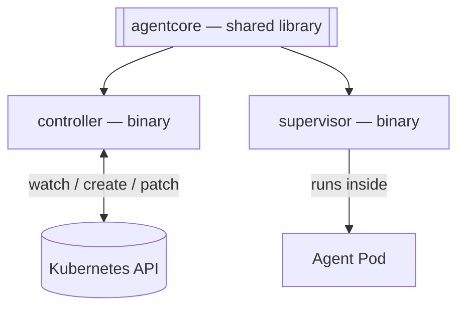

# AI agent subsystem

Run autonomous coding agents as first-class **Kubernetes** resources. Describe the work, pick a
runtime, launch a run — a reconciling controller does the rest. Kubernetes stays the single source
of truth: a run *is* a resource, and its result lives on the resource's `status`.

This is a clean-sheet, standalone rebuild of an internal subsystem, written in **D** as a statically
linked [dub](https://dub.pm) monorepo with **no runtime dependencies**.

📖 **Documentation:** https://glowing-garbanzo-y7ek98q.pages.github.io/

## The model

Three Custom Resources reference each other in a chain:



- **AgentDefinition** — the recipe: prompt template, model, allowed tools, permissions, output sinks.
- **Station** — the runtime: a Pod template plus a recipe reference and run-history limits.
- **Agent** — one run: a Station reference, parameters, and a lifecycle `status`.

The controller watches Agents, builds a Job per run, supervises it, patches the Agent's status, and
prunes old runs. The agent toolchain is *injected* into the run Pod, so Stations only need a
glibc-based base image.

## Architecture

A single dub monorepo (every package under `packages/`) producing **two runtime binaries** and a
**shared library**, statically linked with LDC, plus a `crdgen` dev tool:



- **`agentcore`** — CRD types, Kubernetes client, the pure reconcile state machine, prompt
  templating, and the Job builder.
- **`controller`** — the operator: reconciles Agents into Jobs and back.
- **`supervisor`** — runs inside the Job Pod, supervises the agent process, and streams its output.
- **`crdgen`** — dev/CI tool that generates `deploy/crds` from the annotated `agentcore` structs.

## Repository layout

```
ai-agent-subsystem/
├── README.md
├── dub.json       # root: subPackages
├── packages/      # agentcore (lib) + controller, supervisor, crdgen (apps)
├── deploy/        # CRDs (generated), RBAC, controller manifest
├── scripts/       # check-crd-drift.sh
└── website/       # documentation site (Astro Starlight)
```

## Documentation site

The docs live in [`website/`](website/) and deploy to GitHub Pages on every push to `main`.

```sh
cd website
npm install
npm run dev      # local preview at http://localhost:4321/
npm run build    # production build
```

> Requires Node.js 22+.

## Status

Active development. The controller, supervisor, initializer, and the `agentcore` library are
implemented and covered by unit + integration tests, and tagged releases publish signed, SBOM'd
images plus a one-command `install.yaml`. The CRD APIs are `v1alpha1` (pre-GA) and may still change.
See the [roadmap](https://glowing-garbanzo-y7ek98q.pages.github.io/contribute/roadmap/) for direction.

## Releases

Cut a release by pushing a version tag:

```sh
git tag v0.1.0 && git push origin v0.1.0
```

The [`Publish images`](.github/workflows/images.yml) workflow builds, pushes, and cosign-signs the
controller and agent images for the tag (each with an SPDX SBOM and SLSA provenance attestation). It
then renders `deploy/` to a single digest-pinned `install.yaml` and attaches it to the GitHub
Release — the artifact end users install with one command:

```sh
kubectl apply -f https://github.com/re-cinq/ai-agent-subsystem/releases/latest/download/install.yaml
```

Finally it opens a PR that pins `deploy/` and the install page's cosign-verify example to the exact
signed digests (sourced from the build, not a mutable tag), so `main` and `kubectl apply -k deploy`
never ship a floating `:latest`. The local equivalent is `scripts/pin-image-digests.sh`.

## License

[AGPL-3.0](LICENSE).
