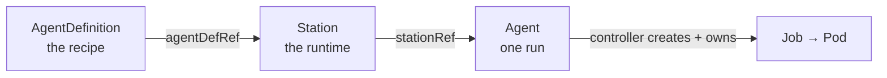
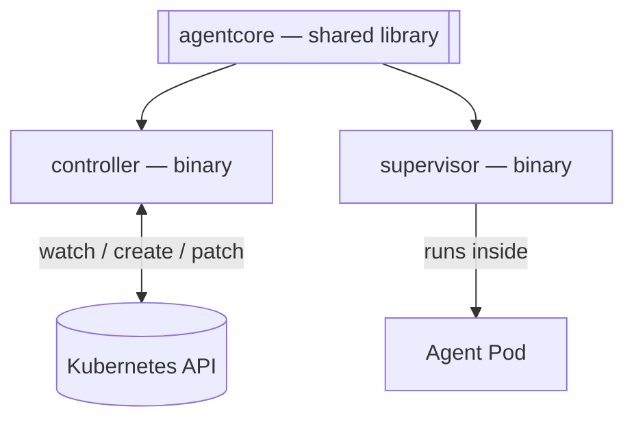

# ai-agent-subsystem

Run autonomous coding agents as first-class **Kubernetes** resources. Describe the work, pick a
runtime, launch a run — a reconciling controller does the rest. Kubernetes stays the single source
of truth: a run *is* a resource, and its result lives on the resource's `status`.

This is a clean-sheet, standalone rebuild of an internal subsystem, written in **D** as a statically
linked [dub](https://dub.pm) monorepo with **no runtime dependencies**.

📖 **Documentation:** https://glowing-garbanzo-y7ek98q.pages.github.io/

## The model

Three Custom Resources reference each other in a chain:



- **AgentDefinition** — the recipe: prompt template, model, allowed tools, permissions, output sinks.
- **Station** — the runtime: a Pod template plus a recipe reference and run-history limits.
- **Agent** — one run: a Station reference, parameters, and a lifecycle `status`.

The controller watches Agents, builds a Job per run, supervises it, patches the Agent's status, and
prunes old runs. The agent toolchain is *injected* into the run Pod, so Stations only need a
glibc-based base image.

## Architecture

A single dub monorepo producing **two binaries** and **one shared library**, statically linked with
LDC:



- **`agentcore`** — CRD types, Kubernetes client, the pure reconcile state machine, prompt
  templating, and the Job builder.
- **`controller`** — the operator: reconciles Agents into Jobs and back.
- **`supervisor`** — runs inside the Job Pod, supervises the agent process, and streams its output.

## Repository layout

```
ai-agent-subsystem/
├── README.md
├── source/        # controller and supervisor entrypoints (D)
├── packages/      # agentcore shared library (D)
├── deploy/        # CRDs, RBAC, controller manifest
├── tests/         # unit tests
└── website/       # documentation site (Astro Starlight)
```

## Documentation site

The docs live in [`website/`](website/) and deploy to GitHub Pages on every push to `main`.

```sh
cd website
npm install
npm run dev      # local preview at http://localhost:4321/
npm run build    # production build
```

> Requires Node.js 22+.

## Status

This phase delivers the documentation and scaffold; the D implementation follows, guided by the
docs. See the [roadmap](https://glowing-garbanzo-y7ek98q.pages.github.io/contribute/roadmap/).

## License

[AGPL-3.0](LICENSE).
