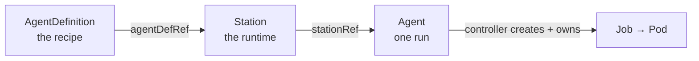
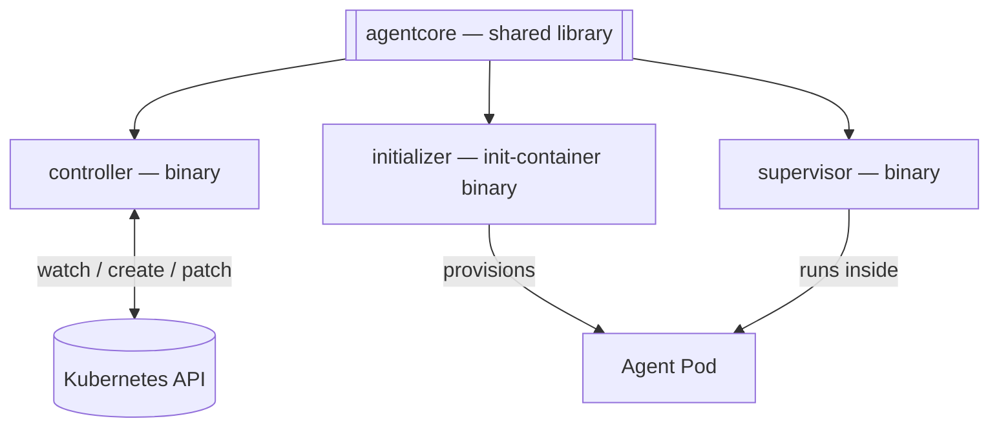

# AI agent subsystem

Run autonomous coding agents as first-class **Kubernetes** resources. Describe the work, pick a
runtime, launch a run — a reconciling controller does the rest. Kubernetes stays the single source
of truth: a run *is* a resource, and its result lives on the resource's `status`.

This is a clean-sheet, standalone rebuild of an internal subsystem, written in **D** as a statically
linked [dub](https://dub.pm) monorepo with **no runtime dependencies**.

📖 **Documentation:** https://re-cinq.github.io/ai-agent-subsystem/

## Install

> The prebuilt agent runtime image is **private**, so the published `install.yaml` is not pullable
> from an arbitrary cluster. Third-party users build the two images from source and push them to a
> registry their cluster can pull from, then install pointing at those.

You need a Kubernetes cluster, `kubectl`, and Docker (with Buildx). Both images build from the repo
root — build them, tag for **your** registry, and push:

```sh
REGISTRY=your-registry.example.com/your-project   # a registry your cluster can pull from
TAG=v0.1.0

docker build -f deploy/Dockerfile.controller       -t "$REGISTRY/ai-agent-controller:$TAG" .
docker build -f scripts/container/Dockerfile.agent -t "$REGISTRY/ai-agent:$TAG"            .

docker push "$REGISTRY/ai-agent-controller:$TAG"
docker push "$REGISTRY/ai-agent:$TAG"
```

Point the manifests at your images. The controller image is set via the kustomize `images:` override
in [`deploy/kustomization.yaml`](deploy/kustomization.yaml); the agent runtime the controller injects
into each run pod is the `AGENT_IMAGE` env in [`deploy/controller.yaml`](deploy/controller.yaml):

```sh
( cd deploy && kustomize edit set image ghcr.io/re-cinq/ai-agent-controller="$REGISTRY/ai-agent-controller:$TAG" )
# then set AGENT_IMAGE in deploy/controller.yaml to "$REGISTRY/ai-agent:$TAG"
```

If your registry needs credentials to pull, create an image pull secret in the `ai-agents` namespace
and reference it from the controller Deployment (and the injected run pods). Then apply the
kustomization — it stands the whole subsystem up in its own `ai-agents` namespace (CRDs, RBAC,
NetworkPolicy, controller):

```sh
kubectl apply -k deploy
```

Verify the controller is up and reconciling:

```sh
kubectl -n ai-agents get deploy,pods
kubectl -n ai-agents logs deploy/agent-controller
```

With the controller running, define your first recipe from the [`examples/`](examples/). See the
[install guide](https://re-cinq.github.io/ai-agent-subsystem/setup/install/) for more detail.

## The model

Three Custom Resources reference each other in a chain:



- **AgentDefinition** — the recipe: prompt template, model, allowed tools, permissions, output sinks.
- **Station** — the runtime: a Pod template plus a recipe reference and run-history limits.
- **Agent** — one run: a Station reference, parameters, and a lifecycle `status`.

The controller watches Agents, builds a Job per run, supervises it, patches the Agent's status, and
prunes old runs. The agent toolchain is *injected* into the run Pod, so Stations only need a
glibc-based base image.

## Architecture

A single dub monorepo (every package under `packages/`) producing **three runtime binaries** and a
**shared library**, statically linked with LDC, plus `crdgen`/`tsgen` codegen tools:



- **`agentcore`** — CRD types, Kubernetes client, the pure reconcile state machine, prompt
  templating, and the Job builder.
- **`controller`** — the operator: reconciles Agents into Jobs and back.
- **`initializer`** — the init container: clones repos and installs the agent CLI before the run.
- **`supervisor`** — runs inside the Job Pod, supervises the agent process, and streams its output.
- **`crdgen`** / **`tsgen`** — dev/CI tools that generate `deploy/crds` and the `@re-cinq/agent-contracts`
  TypeScript types from the annotated `agentcore` structs.

## Repository layout

```
ai-agent-subsystem/
├── README.md
├── dub.json       # root: subPackages
├── packages/      # agentcore (lib) + controller, supervisor, initializer (apps); crdgen, tsgen, mockagent, itest (tooling/tests)
├── deploy/        # CRDs (generated), RBAC, controller manifest
├── scripts/       # drift checks, integration-test runners, container builds
└── website/       # documentation site (Astro Starlight)
```

## Documentation site

The docs live in [`website/`](website/) and deploy to GitHub Pages on every push to `main`.

```sh
cd website
npm install
npm run dev      # local preview at http://localhost:4321/
npm run build    # production build
```

> Requires Node.js 22+.

## Contributing

[`CONTRIBUTING.md`](CONTRIBUTING.md) covers the toolchain, the `make` targets for building and
testing, the integration-test tiers, and how the generated CRDs and TypeScript contracts stay in
sync. The [building guide](https://re-cinq.github.io/ai-agent-subsystem/contribute/building/) on
the docs site goes deeper.

## Status

Active development. The controller, supervisor, initializer, and the `agentcore` library are
implemented and covered by unit + integration tests, and tagged releases publish signed, SBOM'd
images plus a one-command `install.yaml`. The CRD APIs are `v1alpha1` (pre-GA) and may still change.
See the [roadmap](https://re-cinq.github.io/ai-agent-subsystem/contribute/roadmap/) for direction.

## Releases

Cut a release by pushing a version tag:

```sh
git tag v0.1.0 && git push origin v0.1.0
```

The [`Publish images`](.github/workflows/images.yml) workflow builds, pushes, and cosign-signs the
controller and agent images for the tag (each with an SPDX SBOM and SLSA provenance attestation). It
then renders `deploy/` to a single digest-pinned `install.yaml` and attaches it to the GitHub
Release — the artifact end users install with one command:

```sh
kubectl apply -f https://github.com/re-cinq/ai-agent-subsystem/releases/latest/download/install.yaml
```

Finally it opens a PR that pins `deploy/` and the install page's cosign-verify example to the exact
signed digests (sourced from the build, not a mutable tag), so `main` and `kubectl apply -k deploy`
never ship a floating `:latest`. The local equivalent is `scripts/pin-image-digests.sh`.

## License

[Apache-2.0](LICENSE).
