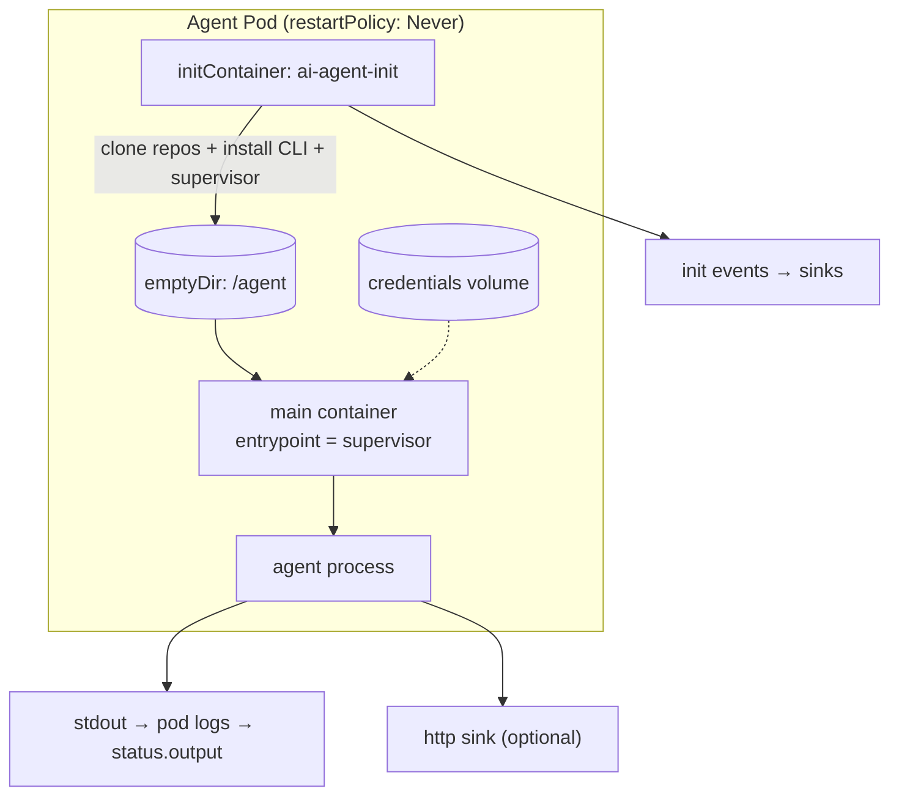

This page describes what happens *inside* the Pod once the controller has created a Job. The design
goal is that Stations stay simple: they bring a base image, and the controller injects everything the
agent needs.

## The injected-kernel model

1. **Init container** (`ai-agent-init`) prepares the shared `emptyDir` mounted at `/agent`: it clones
   the recipe's repos into the workspace, installs the agent CLI (Claude via the official installer),
   and self-bootstraps any missing prerequisites. See [The init container](#the-init-container).
2. **Main container**: the Station's container, with its command overridden to run the supervisor
   from `/agent`. Because the runtime is glibc-linked, the Station base image must be glibc-based.
3. **Security context**: the init container runs as **root** so it can install packages; the main
   container runs as a non-root user (`runAsNonRoot`, fixed UID/GID, `fsGroup`). Both share `HOME`
   inside `/agent`, and `$HOME/.local/bin` (where the CLI installer drops `claude`) is on the main
   container's `PATH`.

## What the controller injects into the container

The Job builder sets the container's **command** to the supervisor followed by the agent argv, built
by the agent adapter from the recipe (see [Pluggable agents](#pluggable-agents)), and injects a few
environment variables:

- `AGENT_SINKS`: the recipe's `output.sinks` as JSON (`http` + `file` destinations).
- `AGENT_NOTIFY_URL`: shorthand for a single `http` sink.
- `AGENT_PARAMETERS`: the run parameters as JSON, when present.
- `AGENT_REPOS`: the recipe's `resources.repos` as JSON, for the init container to clone.
- `WORKSPACE_DIR`: where the init container clones repos (defaults to `/workspace`).
- `TARGET_REPO` / `BRANCH_NAME`: set when the Agent provides them.
- `AGENT_NAME` / `STATION_NAME` / `TASK_ID`: the run's identity, stamped onto every event.
- `POD_NAME` / `POD_NAMESPACE`: the pod's identity, from the downward API.
- `PATH` / `HOME`: pointed at the injected bundle and home directory.

It also sets default resource requests/limits and an `activeDeadlineSeconds` derived from the
Station's `deadlineMinutes`.

## The init container

`ai-agent-init` runs before the supervisor and provisions the environment from what the recipe
declares, never from hardcoded policy. It runs a list of **tools** in order; each tool decides for
itself whether the run needs it:

| Tool | Active when | Does |
| --- | --- | --- |
| `supervisor` | always | copies the supervisor binary baked into the agent image into `/agent/bin`, so the main container can exec it as PID 1. Idempotent across init retries. |
| `git` | `resources.repos` is non-empty | clones each repo (full history) into `WORKSPACE_DIR`, checking out its `ref` (branch, tag, or SHA). Re-entrant across init retries. Private repos authenticate with `token_secret` (below). |
| `claude` | the recipe's `model` resolves to Claude (same routing as [pluggable agents](#pluggable-agents)) | installs the Claude CLI via the official installer (`curl -fsSL https://claude.ai/install.sh \| bash`). |

A repo's `token_secret` names the **environment variable** holding its access token (the controller
populates it from the secret store, the same way [secrets](./agentdefinition.md) become env
vars). The clone authenticates through a git credential helper that reads that variable **by name**
at clone time, so the token value never appears in an argv or a log line; only the git child that
inherits the environment ever sees it. The env-var name is validated before use, and the repo url is
never passed through a shell.

Before running the tools it **self-bootstraps prerequisites**: any executable a tool needs (`git`,
`bash`, `curl`, `sha256sum`) that isn't on `PATH` is installed using the package manager detected
from the distro (`apt`/`dnf`/`apk`). On a base image that already ships these, nothing is installed.

Throughout, the init reports its own lifecycle (`started`, per-tool `running`, `succeeded`,
`failed`) to the **same `output.sinks`** as the agent (`AGENT_SINKS` + `AGENT_NOTIFY_URL`), using the
same `{"source": {…}, "event": …}` envelope, so init progress is observable on the same channel and
correlates with the agent's events. A non-zero exit fails the Pod before the supervisor starts.

Adding a tool is one new `Tool` implementation plus a registry entry; adding a distro is one new
`PackageManager`; nothing else changes.

## The supervisor

The supervisor is the Pod's entrypoint (PID 1). It:

- Spawns the agent argv it was handed (built by the controller from the recipe).
- Reads the agent's stdout line by line, **wraps each event in a `{"source": {…}, "event": …}`
  envelope** stamped with the run's identity (agent, station, task, pod, namespace) so it stays
  traceable through a workflow, echoes the enriched event to its own stdout (captured in the pod
  logs, and therefore in `status.output`), and **fans it out to every configured sink**: `http`
  (POST) and `file` (append).
- Forwards `SIGTERM`/`SIGINT` to the agent for graceful shutdown, and ignores `SIGPIPE` so a broken
  sink can't kill it.
- Exits with the agent's exit code.

It runs on vibe's event loop and uses vibe's HTTP client for http sinks.

## Pluggable agents

The agent CLI is **not hardcoded**. `agentcore.agent.Agent` is a small interface (`name()` and
`command(recipe, renderedPrompt)`) that each provider implements, mapping the
[`AgentDefinition`](./agentdefinition.md) recipe (model, tools, permission mode, max turns) to
the provider's argv. The controller's job-builder picks the adapter from the recipe's `model` and
bakes the resulting command into the Job; the supervisor just runs it.

| Provider | Models | Adapter | Command |
| --- | --- | --- | --- |
| Claude Code | `claude-*` (default) | `ClaudeAgent` | `claude --print --output-format stream-json …` |
| OpenAI Codex | `gpt-*`, `o*`, `*codex*` | `CodexAgent` | `codex exec --json …` |

Both emit newline-delimited JSON, so the supervisor streams them identically. Adding a provider is
one new `Agent` implementation plus a `model` match; nothing else changes.

## Output and credentials

- **Output** is emitted as one self-identifying JSON event per line:
  `{"source": {"agent","station","task","pod","namespace"}, "event": <the agent's JSON>}`, so any
  consumer in a workflow / assembly line can correlate it back to its run. It always goes to stdout
  (pod logs), which the controller reads back on a terminal transition into the Agent's
  `status.output` (alongside the agent container's real `status.exitCode`), capped to the last
  `MAX_OUTPUT_BYTES` (default 256 KiB, tail-preserving) so the Agent object stays under etcd's
  ~1.5 MB per-object limit. If the pod was already garbage-collected by the time the controller reads
  back, the Agent still reaches a terminal phase but `status.failureReason` records why the output is
  missing (see the [controller lifecycle](./controller-lifecycle.md)) rather than leaving it
  silently empty. It also goes to every sink
  the recipe declares: `http` (POST per event) and `file` (append per event). When `output.select` is
  set, sink delivery is filtered to the listed event types; each provider event is normalized to the
  `tool_call`/`message`/`tool_result`/`result`/`usage` vocabulary and matched against the selectors
  (with optional `tool`/`contains` narrowing); stdout still receives every event type, so
  `status.output` is never `select`-filtered, only size-capped to the tail.
- **Credentials** are the agent's own concern: the controller injects the provider's API key
  (`ANTHROPIC_API_KEY`, `OPENAI_API_KEY`, …) as an environment variable from a Kubernetes Secret
  (`AgentDefinition.spec.resources.secrets`). Each `secrets` entry `{name, ref}` becomes a container
  env var `name` sourced via `secretKeyRef` from a single namespace Secret named **`agent-secrets`**,
  with `ref` as the key inside it (the operator creates that Secret out of band). Plain
  `resources.env` entries are injected as literal env vars. The supervisor inherits this environment
  and passes it to the agent CLI; it stages nothing itself.
