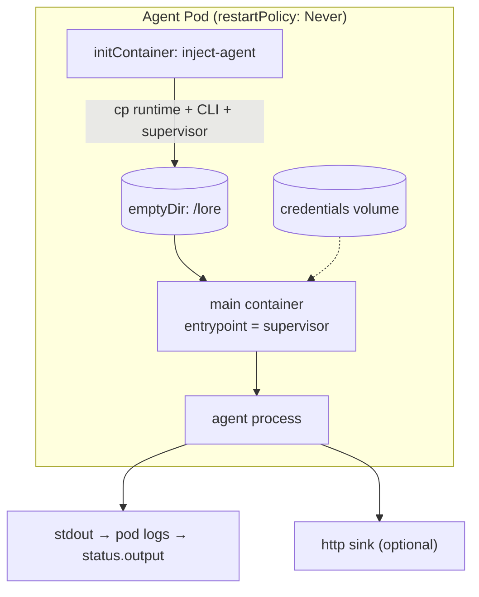

This page describes what happens *inside* the Pod once the controller has created a Job. The design
goal is that Stations stay simple: they bring a base image, and the controller injects everything the
agent needs.

## The injected-kernel model

1. **Init container** copies the language runtime, the agent CLI, and the supervisor binary from the
   agent image into a shared `emptyDir` mounted at `/lore`.
2. **Main container** — the Station's container, with its command overridden to run the supervisor
   from `/lore`. Because the runtime is glibc-linked, the Station base image must be glibc-based.
3. **Security context** runs as a non-root user (`runAsNonRoot`, fixed UID/GID, `fsGroup`).

## What the controller injects into the container

The Job builder sets the container's **command** to the supervisor followed by the agent argv — built
by the agent adapter from the recipe (see [Pluggable agents](#pluggable-agents)) — and injects a few
environment variables:

- `LORE_NOTIFY_URL` — set when the recipe declares an `http` output sink.
- `LORE_PARAMETERS` — the run parameters as JSON, when present.
- `TARGET_REPO` / `BRANCH_NAME` — set when the Agent provides them.
- `PATH` / `HOME` — pointed at the injected bundle and home directory.

It also sets default resource requests/limits and an `activeDeadlineSeconds` derived from the
Station's `deadlineMinutes`.

## The supervisor

The supervisor is the Pod's entrypoint (PID 1). It:

- Spawns the agent argv it was handed (built by the controller from the recipe).
- Reads the agent's stdout line by line, echoes each line to its own stdout (captured in the pod
  logs, and therefore in `status.output`), and POSTs each line to the http sink when one is set.
- Exits with the agent's exit code. (Forwarding `SIGTERM` to the agent for graceful shutdown on pod
  termination is a pending item.)

It runs on vibe's event loop, and posts to the http sink with vibe's HTTP client.

## Pluggable agents

The agent CLI is **not hardcoded**. `agentcore.agent.Agent` is a small interface — `name()` and
`command(recipe, renderedPrompt)` — that each provider implements, mapping the
[`AgentDefinition`](/concepts/agentdefinition/) recipe (model, tools, permission mode, max turns) to
the provider's argv. The controller's job-builder picks the adapter from the recipe's `model` and
bakes the resulting command into the Job; the supervisor just runs it.

| Provider | Models | Adapter | Command |
| --- | --- | --- | --- |
| Claude Code | `claude-*` (default) | `ClaudeAgent` | `claude --print --output-format stream-json …` |
| OpenAI Codex | `gpt-*`, `o*`, `*codex*` | `CodexAgent` | `codex exec --json …` |

Both emit newline-delimited JSON, so the supervisor streams them identically. Adding a provider is
one new `Agent` implementation plus a `model` match — nothing else changes.

## Output and credentials

- **Output** is captured two ways: always to stdout (pod logs → `status.output`), and optionally to
  an `http` sink for streaming consumers.
- **Credentials** are the agent's own concern: the controller injects the provider's API key
  (`ANTHROPIC_API_KEY`, `OPENAI_API_KEY`, …) as an environment variable from a Kubernetes Secret
  (`AgentDefinition.spec.resources.secrets`). The supervisor stages nothing.
