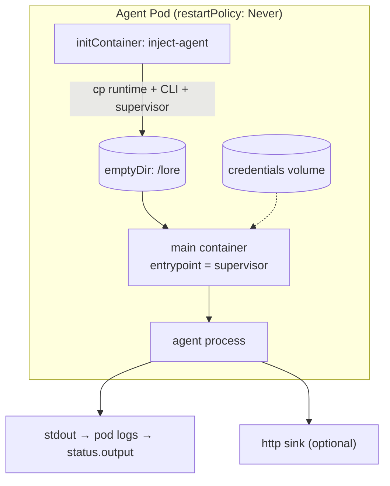

This page describes what happens *inside* the Pod once the controller has created a Job. The design
goal is that Stations stay simple: they bring a base image, and the controller injects everything the
agent needs.

## The injected-kernel model

1. **Init container** copies the language runtime, the agent CLI, and the supervisor binary from the
   agent image into a shared `emptyDir` mounted at `/lore`.
2. **Main container** — the Station's container, with its command overridden to run the supervisor
   from `/lore`. Because the runtime is glibc-linked, the Station base image must be glibc-based.
3. **Security context** runs as a non-root user (`runAsNonRoot`, fixed UID/GID, `fsGroup`).

## What the controller injects into the container

The Job builder filters and sets the container's environment from the recipe and run:

- `LORE_PROMPT` — the rendered prompt.
- `LORE_MODEL` — the recipe's model, or the default.
- `LORE_NOTIFY_URL` — set when the recipe declares an `http` output sink.
- `LORE_PARAMETERS` — the run parameters as JSON, when present.
- `TARGET_REPO` / `BRANCH_NAME` — set when the Agent provides them.
- `PATH` / `HOME` — pointed at the injected bundle and home directory.

It also sets default resource requests/limits and an `activeDeadlineSeconds` derived from the
Station's `deadlineMinutes`.

## The supervisor

The supervisor is the Pod's entrypoint (PID 1). It:

- Restores agent credentials/config from a backup directory if present.
- Launches the agent process configured for **`stream-json`** output.
- Reads the agent's stdout line by line, echoes each line to its own stdout (captured in the pod
  logs, and therefore in `status.output`), and POSTs each line to the http sink when one is set.
- Forwards `SIGTERM`/`SIGINT` to the child for graceful shutdown (used when the deadline is hit or
  the run is cancelled).
- Flushes any buffered output and exits with the child's exit code.

## Output and credentials

- **Output** is captured two ways: always to stdout (pod logs → `status.output`), and optionally to
  an `http` sink for streaming consumers.
- **Credentials** are mounted into the container (a credentials volume) and restored by the
  supervisor before the agent starts. Production secret wiring is on the
  [roadmap](/ai-agent-subsystem/contribute/roadmap/).
