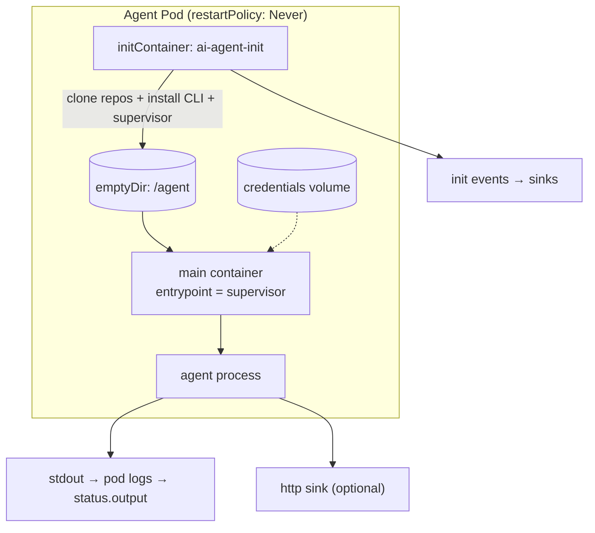

This page describes what happens *inside* the Pod once the controller has created a Job. The design
goal is that Stations stay simple: they bring a base image, and the controller injects everything the
agent needs.

## The injected-kernel model

```mermaid
flowchart TB
    subgraph POD["Agent Pod (restartPolicy: Never)"]
        direction TB
        INIT["initContainer: ai-agent-init"] -->|"clone repos + install CLI + supervisor"| VOL[("emptyDir: /agent")]
        VOL --> MAIN["main container<br/>entrypoint = supervisor"]
        MAIN --> PROC["agent process"]
        CREDS[("credentials volume")] -.-> MAIN
    end
    INIT --> NOTIFY["init events → sinks"]
    PROC --> STDOUT["stdout → pod logs → status.output"]
    PROC --> HTTP["http sink (optional)"]
```

1. **Init container** (`ai-agent-init`) prepares the shared `emptyDir` mounted at `/agent`: it clones
   the recipe's repos into the workspace, installs the agent CLI (Claude via the official installer),
   and self-bootstraps any missing prerequisites. See [The init container](#the-init-container).
2. **Main container**: the Station's container, with its command overridden to run the supervisor
   from `/agent`. Because the runtime is glibc-linked, the Station base image must be glibc-based.
3. **Security context**: the init container runs as **root** so it can install packages; the main
   container runs as a non-root user (`runAsNonRoot`, fixed UID/GID, `fsGroup`). Both share `HOME`
   inside `/agent`, and `$HOME/.local/bin` (where the CLI installer drops `claude`) is on the main
   container's `PATH`.

## What the controller injects into the container

The Job builder sets the container's **command** to the supervisor followed by the agent argv, built
by the agent adapter from the recipe (see [Pluggable agents](#pluggable-agents)), and injects a few
environment variables:

- `AGENT_SINKS`: the recipe's `output.sinks` as JSON (`http` + `file` destinations).
- `AGENT_NOTIFY_URL`: shorthand for a single `http` sink.
- `AGENT_PARAMETERS`: the run parameters as JSON, when present.
- `AGENT_REPOS`: the recipe's `resources.repos` as JSON, for the init container to clone.
- `WORKSPACE_DIR`: where the init container clones repos (defaults to `/workspace`).
- `TARGET_REPO` / `BRANCH_NAME`: set when the Agent provides them.
- `AGENT_NAME` / `STATION_NAME` / `TASK_ID`: the run's identity, stamped onto every event.
- `POD_NAME` / `POD_NAMESPACE`: the pod's identity, from the downward API.
- `PATH` / `HOME`: pointed at the injected bundle and home directory.

It also sets default resource requests/limits and an `activeDeadlineSeconds` derived from the
Station's `deadlineMinutes`.

## The init container

`ai-agent-init` runs before the supervisor and provisions the environment from what the recipe
declares, never from hardcoded policy. It runs a list of **tools** in order; each tool decides for
itself whether the run needs it:

| Tool | Active when | Does |
| --- | --- | --- |
| `supervisor` | always | copies the supervisor binary baked into the agent image into `/agent/bin`, so the main container can exec it as PID 1. Idempotent across init retries. |
| `git` | `resources.repos` is non-empty | clones each repo (full history) into `WORKSPACE_DIR`, checking out its `ref` (branch, tag, or SHA). Re-entrant across init retries. Private repos authenticate with `token_secret` (below). |
| the agent CLI (`claude`, `codex`, `gemini`, `opencode`, `exec`) | always; *which* CLI comes from the recipe's `model` (same routing as [pluggable agents](#pluggable-agents)) | installs the one CLI the run's model routes to, via that vendor's official installer — e.g. Claude's `curl -fsSL https://claude.ai/install.sh \| bash`. Picking the installer from the same routing that picks the adapter means "install X" can never drift from "run X". |
| `skills` | always (the repo's own `.claude/skills`); the registry half when `resources.skills_source` is set | stages skills into the run's `$HOME/.claude` so headless `claude --print` auto-loads them user-scope: the cloned repo's own `.claude/skills`, then the registry's `settings.json` (session hooks), then each name in `resources.skills` fetched as `<source>/<name>.tar.gz`. Best-effort — an unreachable registry never fails the run. |
| `conversation` | `resources.conversation` names both a `source` and an `id`, and the vendor has a state directory | restores the prior run's state archive into the vendor's own state dir under `$HOME`, so the agent resumes that conversation instead of starting fresh. Best-effort: a missing archive leaves the run with a fresh conversation. See [continuing a conversation](#continuing-a-conversation). |

A repo's `token_secret` names the **environment variable** holding its access token (the controller
populates it from the secret store, the same way [secrets](./agentdefinition.md) become env
vars). The clone authenticates through a git credential helper that reads that variable **by name**
at clone time, so the token value never appears in an argv or a log line; only the git child that
inherits the environment ever sees it. The env-var name is validated before use, and the repo url is
never passed through a shell.

Before running the tools it **self-bootstraps prerequisites**: any executable a tool needs (`git`,
`bash`, `curl`, `sha256sum`) that isn't on `PATH` is installed using the package manager detected
from the distro (`apt`/`dnf`/`apk`). The staging tools add `sh`, `curl`, and `tar` when they are
active. On a base image that already ships these, nothing is installed.

Throughout, the init reports its own lifecycle (`started`, per-tool `running`, `succeeded`,
`failed`) to the **same `output.sinks`** as the agent (`AGENT_SINKS` + `AGENT_NOTIFY_URL`), using the
same `{"source": {…}, "event": …}` envelope, so init progress is observable on the same channel and
correlates with the agent's events. A non-zero exit fails the Pod before the supervisor starts.

Adding a tool is one new `Tool` implementation plus a registry entry; adding a distro is one new
`PackageManager`; nothing else changes.

## The supervisor

The supervisor is the Pod's entrypoint (PID 1). It:

- Spawns the agent argv it was handed (built by the controller from the recipe).
- Reads the agent's stdout line by line, **wraps each event in a `{"source": {…}, "event": …}`
  envelope** stamped with the run's identity (agent, station, task, pod, namespace) so it stays
  traceable through a workflow, echoes the enriched event to its own stdout (captured in the pod
  logs, and therefore in `status.output`), and **fans it out to every configured sink**: `http`
  (POST) and `file` (append).
- Captures the agent's **stderr** and forwards it to the pod log tagged `[agent]`, rather than
  letting it inherit the supervisor's. It is where a CLI prints auth failures, rate limits and stack
  traces; inherited raw it interleaved with the JSONL event stream the controller caps into
  `status.output`, where a consumer could not tell a crash trace from a malformed event.
- Reads back any file the recipe declared under [`output.watch`](../reference/crd-agentdefinition.md)
  once the agent exits, raising each as a named `{"kind": "file"}` event on the same sinks — *before*
  the terminal lifecycle event, so a consumer treating that as end-of-stream still receives it. See
  the [Notification API](../reference/notification-api.md).
- Enforces its **own run deadline** (`AGENT_DEADLINE_MS`, injected by the controller a fixed margin
  inside the Job's `activeDeadlineSeconds`). An agent that neither exits nor emits a terminal event
  would otherwise leave the supervisor waiting until the kubelet killed the pod — taking the terminal
  event with it, so a wedged run simply stopped. Instead the supervisor forces the agent down
  (`SIGTERM`, then `SIGKILL`), still reports, and exits `124`.
- Forwards `SIGTERM`/`SIGINT` to the agent for graceful shutdown, and ignores `SIGPIPE` so a broken
  sink can't kill it.
- Exits with the agent's exit code.
- Archives this run's conversation state and POSTs it back when the recipe set
  `resources.conversation.pin`, so a later run can continue it. Best-effort: a failed save costs the
  *next* run its continuity, never this one its result.

It runs on vibe's event loop and uses vibe's HTTP client for http sinks.

## Pluggable agents

The agent CLI is **not hardcoded**. `agentcore.agent.Agent` is a small interface (`name()` and
`command(recipe, renderedPrompt)`) that each provider implements, mapping the
[`AgentDefinition`](./agentdefinition.md) recipe (model, tools, permission mode, max turns) to
the provider's argv. The controller's job-builder picks the adapter from the recipe's `model` and
bakes the resulting command into the Job; the supervisor just runs it.

| Provider | Models | Adapter | Command |
| --- | --- | --- | --- |
| Claude Code | `claude-*`, and anything unrecognized (the default) | `ClaudeAgent` | `claude --print --output-format stream-json …` |
| OpenAI Codex | `gpt-*`, `o1*`/`o3*`/`o4*`, `*codex*` | `CodexAgent` | `codex exec --json …` |
| Google Gemini | `gemini-*` | `GeminiAgent` | `gemini --prompt … --output-format stream-json` |
| OpenCode | any id containing `opencode`, e.g. `opencode/anthropic/claude-sonnet-4-6` | `OpenCodeAgent` | `opencode run --format json …` |
| Command runner | the literal id `exec` | `ExecAgent` | the argv from the recipe's `tool_config.command`, with the rendered prompt appended |

Routing is checked in that order, so `opencode/openai/gpt-4.1` reaches OpenCode rather than matching
the Codex `gpt` rule. The `exec` adapter is the non-LLM escape hatch: it spawns a deterministic
command that must honour the same NDJSON stdout protocol (ending with a `{"type":"result", …}` line),
so a scripted step runs on the same rails as a model.

They all emit newline-delimited JSON, so the supervisor streams them identically. Adding a provider
is one new `Agent` implementation plus a `model` match; nothing else changes.

Because the adapter owns the argv, tool permissions map differently per vendor: OpenCode governs tool
access through its own permission model, so a recipe's `allowed_tools` / `disallowed_tools` do not
become flags there.

## Continuing a conversation

By default every run is a fresh conversation. `resources.conversation` makes a run continue a
previous one: `{source, id}` points at the archive of the earlier run's state, the init restores it
into the vendor's own state directory under `$HOME`, and the adapter resumes it.

The seam is vendor-neutral because the CLIs disagree on both halves. Claude appends `--resume <id>`
before the `--` prompt terminator; Codex makes `resume` a *subcommand* taking the prompt as a
positional (`codex exec resume <id> <prompt>`). Claude stores state at
`.claude/projects/<cwd-slug>/<id>.jsonl` while Codex uses
`.codex/sessions/<YYYY>/<MM>/<DD>/rollout-<timestamp>-<id>.jsonl` — a path that cannot be derived
from the id. So state is addressed as a **directory** (`Agent.stateDir()`) and moved as an archive,
which handles multi-file formats for free.

| Provider | State directory | Can pin a chosen id |
| --- | --- | --- |
| Claude Code | `.claude/projects` | yes (`--session-id`) |
| OpenAI Codex | `.codex/sessions` | no — the CLI assigns its own id |
| Google Gemini | `.gemini` | no — the CLI assigns its own id |
| OpenCode, `exec` | — | no |

`pin` is the id this run saves its *own* state as, which makes each run a **fork**: the run it
continued is left intact and independently resumable, so a caller can go back to an earlier run
rather than only ever the latest. A vendor whose CLI cannot accept a chosen id reports that by
returning no arguments rather than appearing to support it.

Everything on this path is best-effort. A missing or unreachable archive leaves the run with a fresh
conversation, and a failed save costs the *next* run its continuity — never this one its result.

## Skills

`resources.skills` names the skills a run gets and `resources.skills_source` is the registry base URL
they come from. The init's skills tool stages three things into `$HOME/.claude` (`HOME` is `/agent`,
which is where headless `claude --print` auto-loads user scope — project scope under cwd `/` never
fires): the cloned repo's own `.claude/skills`, the registry's `settings.json`, and each named skill
fetched as `<source>/<name>.tar.gz`.

Skills are **fetched, never baked**. Nothing org-specific lives in the agent image, so the subsystem
stays consumer-agnostic: the recipe declares intent and hands over a URL, and the subsystem knows
nothing of the registry beyond it. The URL is read from `$AGENT_SKILLS_SOURCE` at run time so a
recipe-supplied string never enters a shell command, and skill names are validated against injection
before use.

## Output and credentials

- **Output** is emitted as one self-identifying JSON event per line:
  `{"source": {"agent","station","task","pod","namespace"}, "event": <the agent's JSON>}`, so any
  consumer in a workflow / assembly line can correlate it back to its run. It always goes to stdout
  (pod logs), which the controller reads back on a terminal transition into the Agent's
  `status.output` (alongside the agent container's real `status.exitCode`), capped to the last
  `MAX_OUTPUT_BYTES` (default 256 KiB, tail-preserving) so the Agent object stays under etcd's
  ~1.5 MB per-object limit. If the pod was already garbage-collected by the time the controller reads
  back, the Agent still reaches a terminal phase but `status.failureReason` records why the output is
  missing (see the [controller lifecycle](./controller-lifecycle.md)) rather than leaving it
  silently empty. It also goes to every sink
  the recipe declares: `http` (POST per event) and `file` (append per event). When `output.select` is
  set, sink delivery is filtered to the listed event types; each provider event is normalized to the
  `tool_call`/`message`/`tool_result`/`result`/`usage` vocabulary and matched against the selectors
  (with optional `tool`/`contains` narrowing); stdout still receives every event type, so
  `status.output` is never `select`-filtered, only size-capped to the tail.
- **Credentials** are the agent's own concern: the controller injects the provider's API key
  (`ANTHROPIC_API_KEY`, `OPENAI_API_KEY`, …) as an environment variable from a Kubernetes Secret
  (`AgentDefinition.spec.resources.secrets`). Each `secrets` entry `{name, ref}` becomes a container
  env var `name` sourced via `secretKeyRef` from a single namespace Secret named **`agent-secrets`**,
  with `ref` as the key inside it (the operator creates that Secret out of band). Plain
  `resources.env` entries are injected as literal env vars. The supervisor inherits this environment
  and passes it to the agent CLI; it stages nothing itself.
