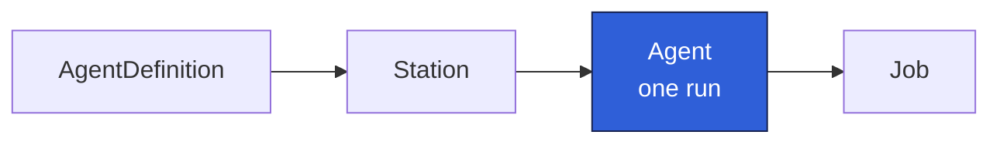

An `Agent` is **one run**. It references a [Station](/concepts/station/), supplies
per-run parameters, and carries a `status` the controller updates as the run progresses.

## Spec

- **`stationRef`**: the Station to run in (which in turn selects the recipe).
- **`parameters`**: a string map used to fill the recipe's `{placeholder}` tokens and passed to the
  agent process.
- **`taskId`**: optional external id for correlation.
- **`targetRepo`** / **`branch`**: optional repo (`owner/name`) and git branch metadata.

Agents are usually created with `generateName` (for example `bug-fixer-run-`) so Kubernetes assigns
a unique name per run.

## Status

The controller owns `status`:

- **`phase`**: `Pending` → `Running` → `Succeeded` | `Failed`.
- **`jobName`**: the Job the controller created.
- **`startedAt`** / **`completedAt`**: run timestamps.
- **`exitCode`**: the process exit code (`0` = success).
- **`output`**: captured summary output (the truncated tail of the pod logs).
- **`failureReason`**: a human-readable reason when the run fails.
- **`prUrl`**: a pull-request URL when applicable.

The phase transitions are driven by the controller's reconcile loop; see
[Controller lifecycle](/concepts/controller-lifecycle/). The full field reference
is in [Agent CRD](/reference/crd-agent/).
