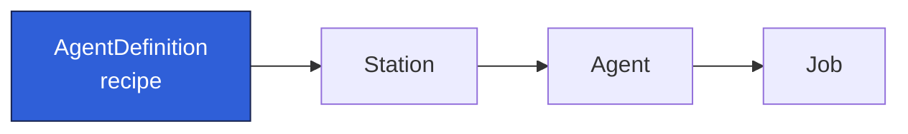

An `AgentDefinition` is the **recipe**: a reusable, environment-independent description of a task.
It carries no runtime details and has no `status`. It is pure configuration that Stations
reference.

## What it carries

- **`prompt`**: the task template. Supports `{placeholder}` tokens filled from an Agent's
  `parameters` at run time (see [Prompt templating](../reference/prompt-templating.md)).
- **`model`**: the model id (for example `claude-sonnet-4-6`). If omitted, the runtime default is
  used.
- **`allowed_tools` / `disallowed_tools`**: permission rules, e.g. `Bash(npm run test:*)` or
  `Bash(rm *)`.
- **`permission_mode`**: `auto` enforces the allow/deny lists; `bypass` grants all tools.
- **`max_turns`**: optional cap on agentic turns; omit for uncapped.
- **`resources`**: `env`, `secrets` (env-var name plus an allowlisted secret-store key),
  `mcp_servers`, and `repos` to make available to the run.
- **`output`**: the result contract: `format` (`text` / `json` / `stream-json`), an optional
  `schema`, event `select` filters, and `sinks` (`stdout`, `http`, `file`).
- **`tool_config`**: a raw passthrough object for tool-specific knobs; unknown fields are preserved.

## Why it is separate

Because the recipe holds nothing environment-specific, the same `AgentDefinition` can run unchanged
across many [Stations](./station.md) (a dev kind cluster, a CI namespace,
or production) by pairing it with a different Pod template.

The full field reference is in
[AgentDefinition CRD](../reference/crd-agentdefinition.md).
