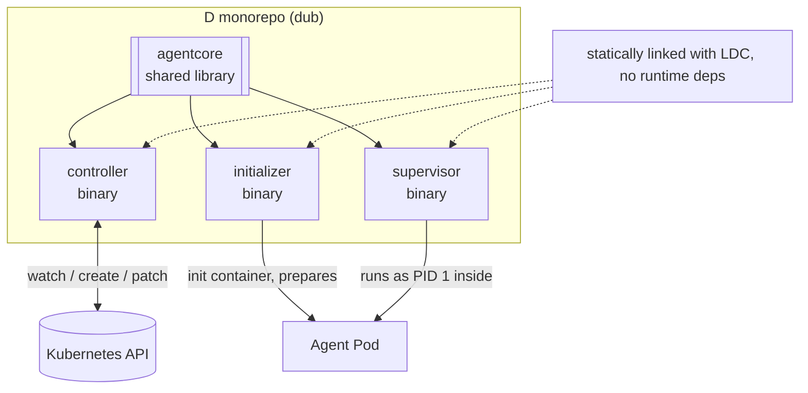

ai-agent-subsystem is built as a single **dub** monorepo: reusable code lives in a shared library and
the executables are thin layers on top, all under `packages/`. It produces **three binaries** and
**one shared library**.

## Components

### `agentcore` — shared library

The pure core, with no process of its own:

- CRD type definitions (`AgentDefinition`, `Station`, `Agent`).
- A Kubernetes REST + watch client.
- The pure reconcile state machine (I/O injected, so it is unit-testable).
- Prompt templating.
- The Job builder.

### `controller` — binary 1

The operator. It watches `Agent` resources, resolves each one's `Station` and `AgentDefinition`,
builds and creates a `Job`, polls the Job's outcome, and patches the Agent's `status`. It also
prunes old runs beyond the Station's history limits and exposes a `/healthz` endpoint.

It uses a **watch + poll** loop: a long-lived watch for low latency, plus a periodic poll (every
~15s) as a safety net for missed events.

### `initializer` — binary 2

Runs as the Pod's **init container**, before the supervisor. It provisions the agent's environment
from what the recipe declares — cloning the `resources.repos` into the workspace and installing the
agent CLI (e.g. Claude via the official installer) — self-bootstrapping any missing prerequisites
(git, curl, sha256sum) through the distro's package manager first, and reporting its lifecycle to the
same output sinks as the agent. New provisioning tools and distros are added behind the `Tool` and
`PackageManager` interfaces. See [Agent runtime](/concepts/agent-runtime/) for the full model.

### `supervisor` — binary 3

Runs inside the Job Pod as the entrypoint. It launches the agent process, streams its `stream-json`
output line by line to the configured sinks, forwards termination signals for graceful shutdown,
and exits with the agent's exit code. It replaces the previous Node-based `run.mjs`.

## Static linking

All three binaries are compiled with **LDC** with the D runtime linked statically, so they ship as
self-contained executables with no language runtime to install — the initializer and supervisor can
be injected into any glibc-based Station image, and run unchanged across the common Kubernetes base
distros (Debian, Ubuntu, RHEL-family, Amazon Linux, Alpine). See [Building](/contribute/building/)
for the dub configuration and link flags.

## Kubernetes as the control plane

There is no external database. The controller's entire state is the set of `Agent` resources and
their `status`. This keeps the system observable with plain `kubectl` and recoverable after a
restart: on startup the controller simply lists Agents and reconciles whatever it finds.
