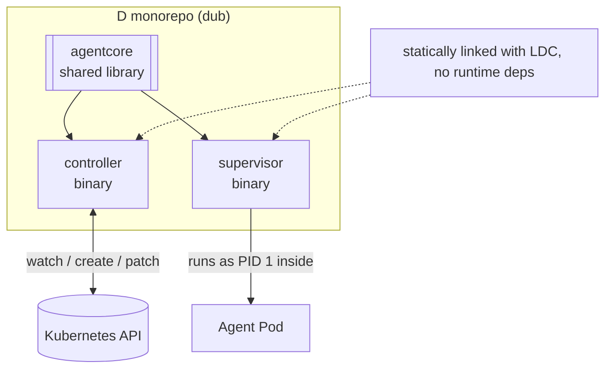

ai-agent-subsystem is built as a single **dub** monorepo (modelled on the layout of
[ogm-server](https://gitlab.com/GISCollective/backend/ogm-server)): the services live at the top
level and reusable code lives in local sub-packages. It produces **two binaries** and **one shared
library**.

## Components

### `agentcore` — shared library

The pure core, with no process of its own:

- CRD type definitions (`AgentDefinition`, `Station`, `Agent`).
- A Kubernetes REST + watch client.
- The pure reconcile state machine (I/O injected, so it is unit-testable).
- Prompt templating.
- The Job builder.

### `controller` — binary 1

The operator. It watches `Agent` resources, resolves each one's `Station` and `AgentDefinition`,
builds and creates a `Job`, polls the Job's outcome, and patches the Agent's `status`. It also
prunes old runs beyond the Station's history limits and exposes a `/healthz` endpoint.

It uses a **watch + poll** loop: a long-lived watch for low latency, plus a periodic poll (every
~15s) as a safety net for missed events.

### `supervisor` — binary 2

Runs inside the Job Pod as the entrypoint. It launches the agent process, streams its `stream-json`
output line by line to the configured sinks, forwards termination signals for graceful shutdown,
and exits with the agent's exit code. It replaces the previous Node-based `run.mjs`.

## Static linking

Both binaries are compiled with **LDC** and statically linked so they ship as self-contained
executables with no runtime dependencies — no language runtime to install in the controller image,
and a supervisor that can be injected into any glibc-based Station image. See
[Building](/contribute/building/) for the dub configuration and link flags.

## Kubernetes as the control plane

There is no external database. The controller's entire state is the set of `Agent` resources and
their `status`. This keeps the system observable with plain `kubectl` and recoverable after a
restart: on startup the controller simply lists Agents and reconciles whatever it finds.
