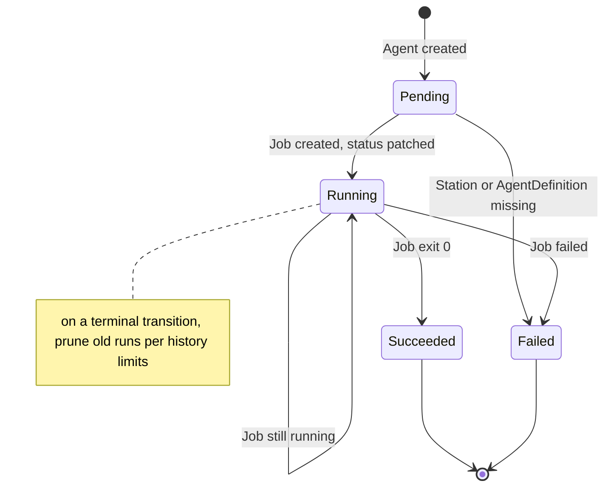
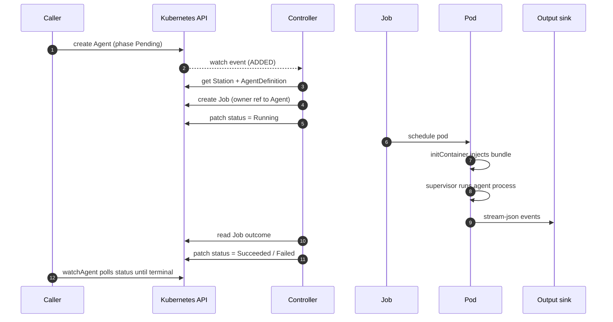
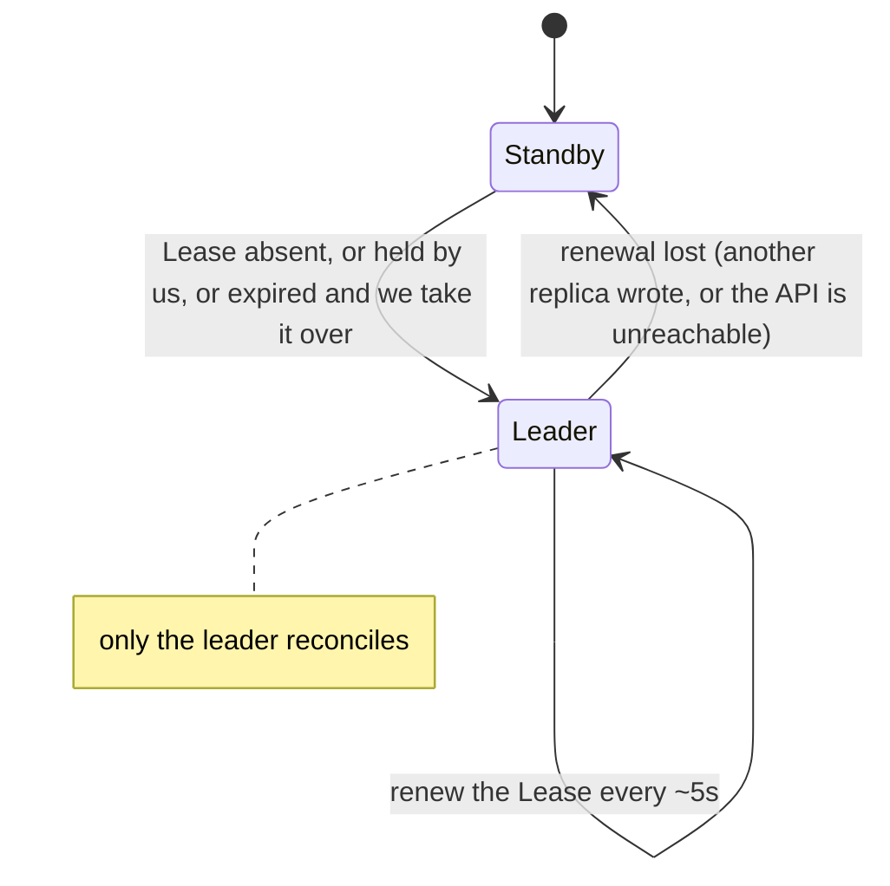

The controller drives every `Agent` from creation to a terminal phase by reconciling its `status`
against the world. Reconciliation is a pure function with all I/O injected, which keeps it
unit-testable.

## State machine

### Transitions

**Pending → Running**

1. Resolve `Station` by `spec.stationRef`; if missing, set `phase = Failed` with a reason and stop.
2. Resolve `AgentDefinition` by `station.spec.agentDefRef`; if missing, fail the same way.
3. Build the Job (see [Agent runtime](/concepts/agent-runtime/)) and create it.
   Creation is idempotent. An already-existing Job is fine.
4. Patch `status`: `phase = Running`, `jobName`, `startedAt`.

**Running → Succeeded | Failed**

1. Read the Job outcome. While it is still running, do nothing.
2. On success, patch `phase = Succeeded` with `exitCode` and `output` (the truncated tail of the pod log).
3. On failure, patch `phase = Failed` with `exitCode`, `failureReason`, and `output` (the truncated tail).
4. After any terminal transition, prune history.

If the run pod was already garbage-collected when the controller reads back (so its captured stdout
is gone), the Agent still reaches its terminal phase but `failureReason` records
`run output unavailable: pod garbage-collected` instead of leaving `output` silently empty. If the
**Job itself** was garbage-collected first (the controller was down or backlogged past
`ttlSecondsAfterFinished`), the outcome is unrecoverable, so the Agent is reported `Failed` with
`run record unavailable: Job garbage-collected before its result was observed` rather than being left
stuck in `Running`.

**Terminal → terminal** is a no-op; reconciling a finished Agent does nothing.

## Launch sequence

## Job ownership

Each Job is created with an owner reference back to its Agent (`controller: true`,
`blockOwnerDeletion: true`). Deleting the Agent garbage-collects the Job. Jobs also set
`ttlSecondsAfterFinished: 3600`, so finished Jobs (and their pods) self-delete one hour after
completion while the Agent's `status` retains the result. This is the window the controller has to
read the pod's exit code and captured stdout back into `status`; one hour comfortably survives a
controller restart or backlog. The trade-off is that finished pods linger that long, but they are
terminal (only an etcd object plus node log disk, no CPU/memory), and [history
pruning](#history-pruning) already cascade-deletes most of them sooner. Past the window the run is
reported terminal with a clear `failureReason` rather than silently losing its output.

## History pruning

On every terminal transition the controller lists the Station's Agents, groups them by phase, sorts
by `completedAt` (newest first), and deletes any beyond the Station's
`successfulRunsHistoryLimit` / `failedRunsHistoryLimit`. This bounds how many finished Agents
accumulate without losing the most recent ones.

## Watch + poll

The controller combines a long-lived **watch** on Agents (low latency, reconnecting on error) with a
periodic **poll** (every ~15s) that reconciles any Agent still in `Pending` or `Running`. The poll
is a safety net for watch events that were missed or dropped.

## Leader election

The controller runs **two replicas** for availability, but only **one** reconciles at a time. The
replicas contend for a single [`coordination.k8s.io/v1` Lease](/reference/rbac-and-network/) named
`agent-controller`; the holder is the leader and runs the watch + poll loop, while standbys stay
idle.

Each tick (~5s) a replica reads the Lease, folds it into a running observation, and decides:

- **no Lease** → create one we hold;
- **we hold it** → renew its `renewTime`;
- **someone else holds it, unrenewed past the 15s lease duration** → take it over;
- **someone else holds a still-valid Lease** → stand by.

Expiry is judged against the replica's **own** clock — the time since it first saw the current
`renewTime` — not the remote timestamp, so clock skew between replicas can't trigger a premature
takeover. Writes carry the Lease's `resourceVersion` as an optimistic-concurrency precondition, so
two standbys can't both win a takeover and a leader that **fails** to renew (lost the race, or lost
the API server) immediately steps down and stops reconciling.

When the leader's pod is deleted it stops renewing; a standby sees the `renewTime` stop changing and
takes over within the lease duration. The brief overlap a partition could cause is harmless anyway:
Job creation is keyed on the Agent name and idempotent (an existing Job is a `409`, not a duplicate),
so two reconcilers never produce two Jobs for one Agent.
