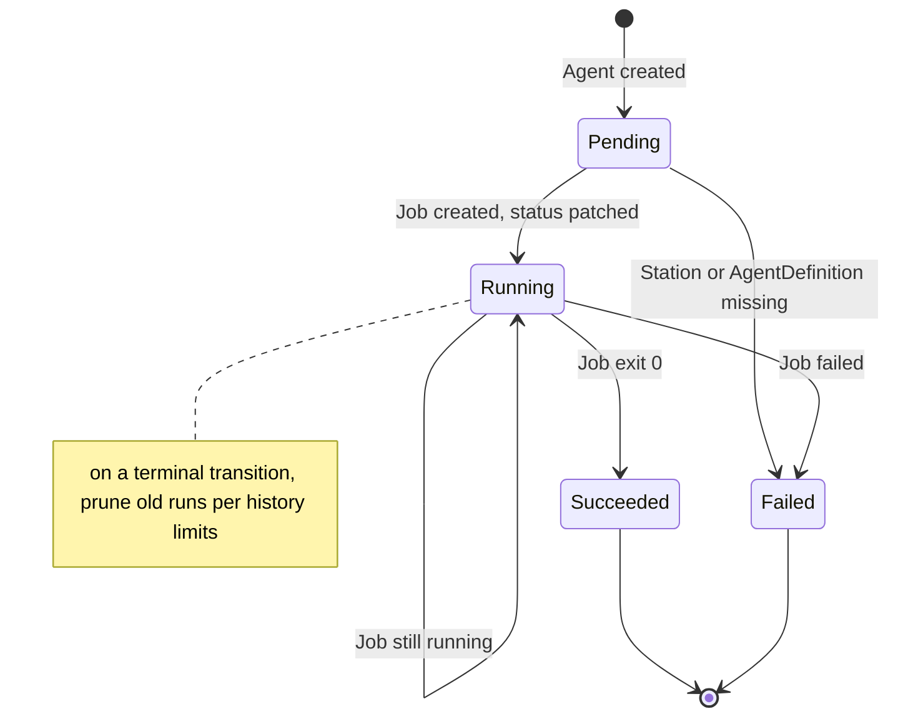
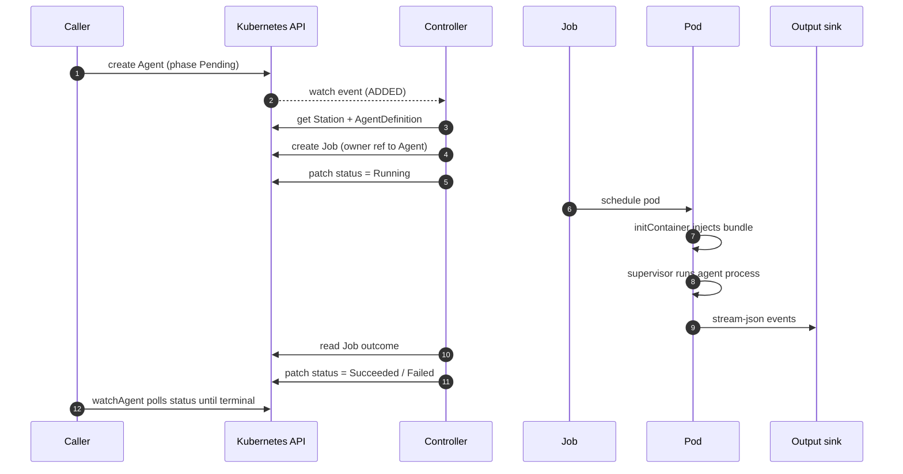

The controller drives every `Agent` from creation to a terminal phase by reconciling its `status`
against the world. Reconciliation is a pure function with all I/O injected, which keeps it
unit-testable.

## State machine

### Transitions

**Pending → Running**

1. Resolve `Station` by `spec.stationRef`; if missing, set `phase = Failed` with a reason and stop.
2. Resolve `AgentDefinition` by `station.spec.agentDefRef`; if missing, fail the same way.
3. Build the Job (see [Agent runtime](/concepts/agent-runtime/)) and create it.
   Creation is idempotent — an already-existing Job is fine.
4. Patch `status`: `phase = Running`, `jobName`, `startedAt`.

**Running → Succeeded | Failed**

1. Read the Job outcome. While it is still running, do nothing.
2. On success, patch `phase = Succeeded` with `exitCode` and `output` (the truncated tail of the pod log).
3. On failure, patch `phase = Failed` with `exitCode`, `failureReason`, and `output` (the truncated tail).
4. After any terminal transition, prune history.

**Terminal → terminal** is a no-op; reconciling a finished Agent does nothing.

## Launch sequence

## Job ownership

Each Job is created with an owner reference back to its Agent (`controller: true`,
`blockOwnerDeletion: true`). Deleting the Agent garbage-collects the Job. Jobs also set
`ttlSecondsAfterFinished: 300`, so finished Jobs self-delete five minutes after completion while the
Agent's `status` retains the result.

## History pruning

On every terminal transition the controller lists the Station's Agents, groups them by phase, sorts
by `completedAt` (newest first), and deletes any beyond the Station's
`successfulRunsHistoryLimit` / `failedRunsHistoryLimit`. This bounds how many finished Agents
accumulate without losing the most recent ones.

## Watch + poll

The controller combines a long-lived **watch** on Agents (low latency, reconnecting on error) with a
periodic **poll** (every ~15s) that reconciles any Agent still in `Pending` or `Running`. The poll
is a safety net for watch events that were missed or dropped.
