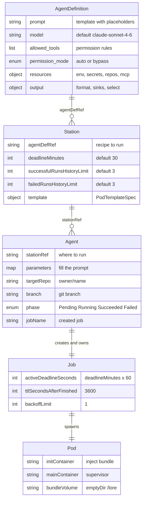
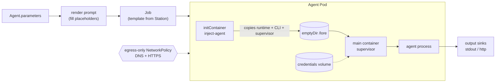

This page is the schema hub. The first diagram shows how the resources reference one another and
what each carries; the second shows how those references turn into a running Pod.

## Data model

`AgentDefinition`, `Station`, and `Agent` form a reference chain. The controller turns an `Agent`
into a `Job`, which Kubernetes turns into a `Pod`.

Read the edges as references:

- A **Station** names exactly one **AgentDefinition** through `spec.agentDefRef`. Many stations may
  point at the same recipe.
- An **Agent** names exactly one **Station** through `spec.stationRef`. Many runs may use the same
  station.
- The controller creates one **Job** per Agent and sets an owner reference, so deleting the Agent
  garbage-collects the Job.
- The **Job** produces one **Pod** that does the work.

## Runtime composition

When the controller reconciles a `Pending` Agent it renders the prompt, clones the Station's Pod
template, and assembles the Pod below. The agent toolchain is *injected* into a shared volume rather
than baked into the Station image.

The same model is described from the controller's perspective in
[Controller lifecycle](/concepts/controller-lifecycle/) and from the pod's
perspective in [Agent runtime](/concepts/agent-runtime/).
