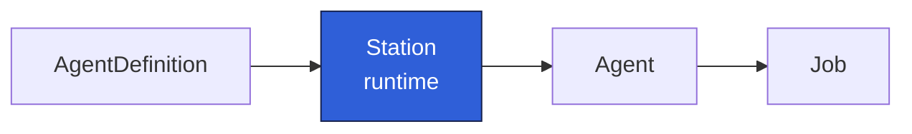

A `Station` is the **runtime template**. It pairs one [AgentDefinition](/concepts/agentdefinition/)
with a Kubernetes `PodTemplateSpec` and a few run-management knobs. It is where "the recipe" meets
"the cluster".

## What it carries

- **`agentDefRef`**: the name of the `AgentDefinition` this Station runs.
- **`template`**: a standard Pod template. The controller wires one container (named `agent`) with
  the rendered prompt and the injected runtime; the rest of the template (base image, volumes,
  node selectors, resource limits) is yours.
- **`deadlineMinutes`**: wall-clock limit per run, default `30`. Becomes the Job's
  `activeDeadlineSeconds` (× 60).
- **`successfulRunsHistoryLimit`** / **`failedRunsHistoryLimit`**: how many terminal Agents to keep
  per phase before the controller prunes the oldest. Both default to `3`.

Like an `AgentDefinition`, a Station has no `status`. It is a template, not a run.

## The injected runtime

The Station's container image does **not** need the agent toolchain. The controller adds an init
container that copies the runtime, the agent CLI, and the supervisor into a shared `emptyDir`, then
overrides the main container to run the supervisor. The only requirement is a **glibc-based** image
(for example `debian:bookworm-slim`), because the injected runtime is glibc-linked. See
[Agent runtime](/concepts/agent-runtime/) for details.

The full field reference is in [Station CRD](/reference/crd-station/).
