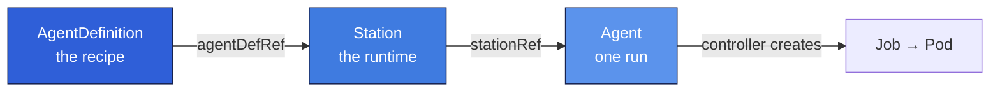

import { Card, CardGrid, LinkCard } from '@astrojs/starlight/components';

## What is ai-agent-subsystem?

**ai-agent-subsystem** turns "run a coding agent" into a declarative Kubernetes operation. You
describe *what* the agent should do (a recipe), *where* it runs (a runtime template), and *which*
run you want (parameters). A controller reconciles each run into a Kubernetes `Job`, supervises it,
streams its output, and records the result on the resource's `status` — Kubernetes stays the single
source of truth.

It is a clean-sheet, standalone rebuild of an internal subsystem, written in **D** as a statically
linked monorepo with no runtime dependencies.

## The three resources

Everything is built from three Custom Resources that reference each other in a chain:

<CardGrid>
	<Card title="AgentDefinition" icon="document">
		The **recipe**: prompt template, model, allowed tools, permissions, and output sinks.
	</Card>
	<Card title="Station" icon="setting">
		The **runtime**: a Pod template plus a recipe reference and run-history limits.
	</Card>
	<Card title="Agent" icon="rocket">
		One **run**: a Station reference, parameters, and a `status` that tracks the lifecycle.
	</Card>
	<Card title="Controller" icon="random">
		Watches Agents, builds Jobs, patches status, and prunes old runs.
	</Card>
</CardGrid>

## Start here

<CardGrid>
	<LinkCard title="How the pieces relate" href="/concepts/relationships/" description="The full relationship schema: data model and runtime composition diagrams." />
	<LinkCard title="Architecture" href="/concepts/architecture/" description="The D monorepo: two binaries and a shared library, statically linked." />
	<LinkCard title="Install" href="/setup/install/" description="Stand up a local cluster and apply the CRDs and controller." />
	<LinkCard title="Examples" href="/tasks/examples/" description="Worked recipes: a bug-fixer and a pure-text story writer." />
</CardGrid>
