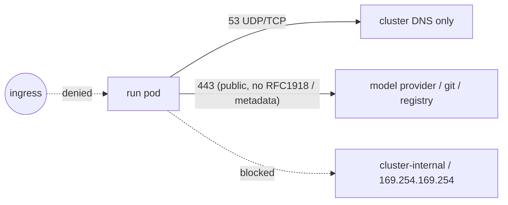

The subsystem ships least-privilege RBAC and a restrictive network policy for run pods.

## Controller role

The controller's ServiceAccount is granted exactly what reconciliation needs:

- **Agents**: watch, list, get, and patch (including `status`); delete (for history pruning).
- **Stations** and **AgentDefinitions**: get and list (read-only).
- **Jobs**: create and get.
- **Pods**: list and read logs (to capture `status.output`).
- **Leases** (`coordination.k8s.io`): get, create, and patch — one Lease the
  replicas contend for so only the leader reconciles (see [leader election](/concepts/controller-lifecycle/#leader-election)).

## Caller role

A separate, narrower role lets other in-cluster apps launch and inspect runs **without** touching
Jobs or pods:

- **Agents**: create, get, list, watch.

This is the role a UI or upstream pipeline binds to when it only needs to start runs and read their
status.

## Network policy for run pods

Run pods get an **egress-only** NetworkPolicy. Ingress is denied; egress is limited to:

- **DNS to the in-cluster resolver only** (CoreDNS/kube-dns) — so untrusted code can't tunnel data
  out through an arbitrary external resolver. This assumes the standard
  `kube-system` / `k8s-app=kube-dns` labels; adjust it for a non-standard DNS setup.
- **HTTPS to the public internet** (model provider, source forges, registries), **excluding** RFC1918
  private ranges and link-local `169.254.0.0/16` — so the agent can't reach cluster-internal services
  (SSRF) or steal credentials from the cloud metadata endpoint `169.254.169.254`.

The policy selects run pods by the `agents.re-cinq.com/component: job` label the
controller stamps on every run pod. It also adds `agents.re-cinq.com/agent` and
`agents.re-cinq.com/station` labels, so a run's pod is traceable with
`kubectl get pods -l agents.re-cinq.com/agent=<name>`.

Tighten the HTTPS egress further — to specific provider CIDRs or through an egress proxy — if your
environment allows.

Run pods also run with `automountServiceAccountToken: false`: the run needs no
Kubernetes API access, so the untrusted agent code never receives a mountable API
credential.

The agent container is hardened beyond the non-root UID: `seccompProfile:
RuntimeDefault`, all Linux capabilities dropped, and `allowPrivilegeEscalation:
false`. When the Station template sets no `resources` on the agent container, the
controller fills in a default request/limit so the run is memory-bounded (not
BestEffort) and can't starve the node; set `resources` on the Station to override.
