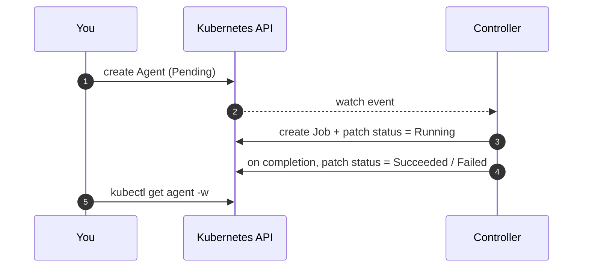

An [Agent](/ai-agent-subsystem/concepts/agent/) is one run. Creating it triggers the controller to
build a Job, supervise it, and record the result.

```yaml
apiVersion: agents.re-cinq.com/v1alpha1
kind: Agent
metadata:
  generateName: bug-fixer-run-
spec:
  stationRef: node-fixer
  taskId: ENG-417
  targetRepo: re-cinq/ai-agent-subsystem
  branch: fix/login-eng-417
  parameters:
    ticket: ENG-417
    repo: re-cinq/ai-agent-subsystem
    branch: fix/login-eng-417
```

`generateName` lets Kubernetes assign a unique name per run.

## What happens



## Launch and watch

```sh
kubectl create -f run.yaml
kubectl get agents -w
```

You will see the Agent move `Pending → Running → Succeeded` (or `Failed`). Inspect the result:

```sh
kubectl get agent <name> -o jsonpath='{.status.phase} {.status.exitCode}{"\n"}'
```

Then [collect the output](/ai-agent-subsystem/tasks/collect-output/).
