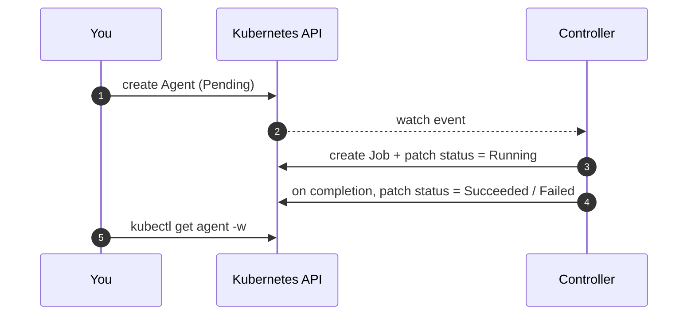

An [Agent](/concepts/agent/) is one run. Creating it triggers the controller to
build a Job, supervise it, and record the result.

```yaml
apiVersion: agents.re-cinq.com/v1alpha1
kind: Agent
metadata:
  generateName: bug-fixer-run-
spec:
  stationRef: node-fixer
  taskId: ENG-417
  targetRepo: re-cinq/ai-agent-subsystem
  branch: fix/login-eng-417
  parameters:
    ticket: ENG-417
    repo: re-cinq/ai-agent-subsystem
    branch: fix/login-eng-417
```

`generateName` lets Kubernetes assign a unique name per run.

## What happens



## Launch and watch

```sh
kubectl create -f run.yaml
kubectl get agents -w
```

You will see the Agent move `Pending → Running → Succeeded` (or `Failed`). Inspect the result:

```sh
kubectl get agent <name> -o jsonpath='{.status.phase} {.status.exitCode}{"\n"}'
```

Then [collect the output](/tasks/collect-output/).

## Verify API-key auth end to end

To prove a run authenticates **purely** from the
[`agent-secrets`](/setup/prerequisites/#credentials) Secret — no host `~/.claude` mount — create the
Secret with a real key, then run a Claude recipe whose only credential source is that Secret:

```sh
kubectl -n ai-agents create secret generic agent-secrets \
  --from-literal=ANTHROPIC_API_KEY="$ANTHROPIC_API_KEY"
```

```yaml
apiVersion: agents.re-cinq.com/v1alpha1
kind: AgentDefinition
metadata: { name: auth-check, namespace: ai-agents }
spec:
  model: claude-sonnet-4-6
  prompt: "Reply with the single word: ok"
  permission_mode: bypass
  max_turns: 1
  resources:
    secrets:
      - name: ANTHROPIC_API_KEY
        ref: ANTHROPIC_API_KEY
  output: { format: stream-json, sinks: [{ type: stdout }] }
---
apiVersion: agents.re-cinq.com/v1alpha1
kind: Station
metadata: { name: auth-check-station, namespace: ai-agents }
spec:
  agentDefRef: auth-check
  deadlineMinutes: 5
  template:
    spec:
      restartPolicy: Never
      containers:
        - name: agent
          image: node:22-bookworm   # glibc >= 2.36 + Node: the init container installs the Claude CLI
---
apiVersion: agents.re-cinq.com/v1alpha1
kind: Agent
metadata: { name: auth-check-run, namespace: ai-agents }
spec: { stationRef: auth-check-station }
```

The Station base must be **glibc ≥ 2.36** (the static-druntime supervisor's floor) with Node
present; the init container installs the Claude CLI into `/lore/.local/bin` (on the run `PATH`). No
`~/.claude` mount is added, so the key can only come from the Secret.

```sh
kubectl -n ai-agents get agent auth-check-run -w         # expect Succeeded
kubectl -n ai-agents logs job/agent-job-auth-check-run   # no auth error (no 401 / "invalid x-api-key")
```

Reaching `Succeeded` with a clean log proves the `agent-secrets` → `ANTHROPIC_API_KEY` → CLI
authentication path. The hermetic half of this chain (Secret → env var → agent child, minus the real
API call) is guarded in CI by `scripts/itest-controller.sh`.
